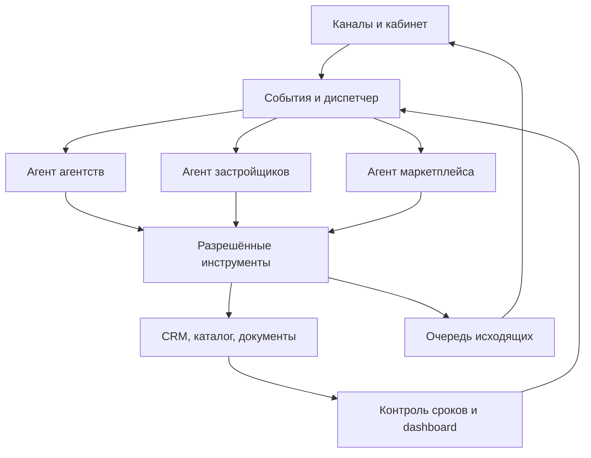

> Дополнение21.09: выставка25.09, deadline24.09. Текущий критический путь и ежедневное исполнение: `project-bible/mira/operations/EXHIBITION-LAUNCH-2026-09-25.md`. AUT-03 приватная передача принята в своём объёме; AUT-04 cloud restore не выполнен. История ниже сохраняется.

# МИРА — roadmap автономной операционной системы

Статус: **принято владельцем, реализация начата**. Операционный день: 18.09.2026; ночная смена: 19.09 Asia/Bangkok. Задание: `MIRA-AUTONOMY-20260919-01`. Координатор: CLOUD. Источник исходного состояния: research commit `4a84228daf04f928bcbe995a33263bbddb7cb019` и receipts. Это рабочее продолжение существующей МИРА, EspoCRM и OMNI.

## Цель и принятое решение

Повседневный цикл МИРА должен выполняться агентами и программными обработчиками: исследование агентств и застройщиков, квалификация, утверждённая переписка, обработка запроса на объект, получение ответа поставщика, возврат агентству, контроль сроков и запись результата. Постоянная работа не зависит от включённого Mac или открытого чата.

Владелец утвердил реализацию архитектуры. Объём автоматических внешних действий определяется настройками действующего процесса. Подписание договора, платёж и изменение неутверждённых коммерческих условий остаются отдельными полномочиями; система сама готовит документы/задачу и фиксирует исключение. Программный диспетчер контролирует процесс, модель выбирает действие внутри выданных инструментов. Контекст хранится в базе. Этот roadmap не означает, что production уже автономен.

Рабочая контрактующая компания по указанию владельца — **WEST EAST TRADE GROUP PTE. LTD.** Поля договора содержат фактическую сторону и подтверждающий документ. Название бренда, группы застройщика и юридического продавца — разные поля. Статус «материнская компания» не выводится из названия и не нужен для привязки договора.

## Где единый учёт

| Назначение | Каноническое место |
|---|---|
| Направление, зависимости и приёмка | Этот документ; ссылка из `06-roadmap.md` |
| Текущие статусы всех направлений | `CLOUD-INBOX/MASTER-STATUS.md` |
| Машинная очередь | `CLOUD-INBOX/QUEUE.json`; не создавать конкурирующую очередь |
| Постановки задач | `CLOUD-INBOX/tasks/<task-id>.md` |
| Получение и результат исполнителя | `CLOUD-INBOX/receipts/<task-id>.json` |
| История изменений | `CLOUD-INBOX/events/`, Git commits, issue #14; журнал решений библии |
| Агентства, исследовательский master | `research/agency-expansion-2026-09-19/master-agencies.json`; прежние IDs и aliases сохраняются |
| Застройщики, исходный master | `data/phuket-developer-master.csv`; пилоты и контактные QA — источники, не независимые CRM |
| Связи и очередь проверки застройщиков | `research/developer-expansion-2026-09-19/`; файлы генерируются из исходников и field-level observations |
| Операционные контакты, письма, договоры, заявки | Приватная EspoCRM и её хранилище документов после приёмки переноса |
| Статус сделки и права кабинета | Существующий marketplace backend; синхронизация по стабильным ID и версии события |

Исследовательские проекции не перезаписывают подписанный договор или более свежую CRM-историю. Договоры, секреты, персональные письма и резервные копии не помещаются в Git. Приватные сведения из Botanica/The Title нормализуются в CRM при переносе.

## Фактическая отправная точка

- LOCAL принял closeout в 18:23:20 UTC; обновлённый receipt содержит `all_done=false`. После ACK получен построчный closeout с manifest (18:39:09 UTC): T11 manifest returned, T12 checkpoint report returned, T14 prepared_not_migrated. Архив остаётся на Mac, облачное восстановление ещё не выполнено.
- Свежий LOCAL receipt сообщает о текущем поручении владельца подготовить **собственный почтовый сервер**, интегрированный с существующей CRM; VPS нет, закупка не разрешена. Не возвращаться автоматически к старому «только Brevo»: LOCAL должен дать disposition по старой mail-задаче и подготовленному варианту. Receipt 18:39:09 UTC уточняет: собственная почта принята в PRIVATE_LOCAL_LAB (SMTP/IMAP, scheduler, reply threading, ACL, зашифрованное восстановление), public mail NOT_RUN. Обязательный выбор Brevo отменён текущим owner decision; повторно его не предлагать как blocker. Automatic DSN/complaint ingestion ещё не готов (manual stop есть).
- Агентства: 345 предварительных групп после последнего сохранённого Saratov checkpoint; 203 RU, 59 BY, 83 прочих. Подходящих по свежему блоку Саратова 4, полностью обогащённых 0; это не число активных партнёров. Свежий LOCAL receipt 18:39:09 UTC сообщает **78 agency research Accounts**; прежние 12 C10 — старый срез. Сверка private CRM с 345 research-группами ещё нужна.
- Пхукет: 618 карточек; в developer master 40 строк, в старом pilot 31, в contact-routes 60 проектных строк, в stage-register 8 групп. Свежий LOCAL receipt содержит **87 developer research Accounts**, а также отдельные holds по таксономии/доменам. Нужен external-ID crosswalk 87 CRM ↔ 40 master ↔ остальные источники. Складывать эти числа нельзя.
- У 111 Phuket-карточек есть унаследованная family, у 507 нет. Новый точный join: 91 однозначное совпадение с master, 5 неоднозначных, 15 family без записи master. Все связи ещё требуют первичной проверки; группа не доказывает продавца и договор.
- Реализованы OMNI и изоляция Анна/WEGC ↔ Ассистент МИРА, бриф и research-подбор. Предыдущие 53 локальных теста — evidence прошлого пакета; его live-приёмка остаётся задачей LOCAL.

## Архитектура

Три роли — логические роли с отдельными инструкциями и полномочиями, не три бесконечно работающих чата. Общие инструменты: найти компанию/проект, загрузить разрешённые знания, создать/обновить кейс, подготовить письмо, поставить задачу, получить статус договора/запроса. Для автономного режима диспетчер валидирует аргументы, разрешение, актуальность, получателя и результат операции. Модель не изменяет права, профиль продукта или факт подписания договора.

Использовать уже реализованные inbox/outbox, профили и CRM bridge OMNI. Новый модуль не создаёт параллельную систему отправки. Публичный каталог не становится базой приватных сделок. Изменяемые цены/наличие/комиссии читаются из проверенного источника с датой и областью действия. Анна на Phuket-сайте сохраняет отдельные знания и историю.

## Конкретная очередь и критерии готовности

| ID | Ответственный / состояние | Что сделать | Зависимость и приёмка |
|---|---|---|---|
| AUT-00 | CLOUD; выполнена постановка | Записать архитектуру, связать общую очередь, историю и текущие задачи | Roadmap + task IDs + source SHA доступны в одной ветке; не потеряны старые задачи |
| AUT-01 | CLOUD; в работе. LOCAL — сверка CRM | Продолжить `MIRA-AGENCIES-20260919-01`: города, независимые агентства, email, публичные рабочие телефоны, имена/роли, WhatsApp/Telegram/VK, источники по полям | Минимум 10 подходящих на город либо явный дефицит. Отдельно Москва/СПб, сети и overseas desks. 60×10=600 — ориентир, не 6000. Население ещё перепроверить официально. Импорт не считается выполненным по числу CSV строк |
| AUT-02 | CLOUD; код и первый data checkpoint готовы, обогащение продолжается | `MIRA-DEVELOPERS-20260919-01`: инвентаризация источников, project→developer→seller→contacts, заполнение пробелов, сверка существующих переговоров | Каждая из 618 Phuket-карточек имеет проверенную связь либо конкретную gap-задачу. Затем остальные опубликованные рынки. Не объединять неоднозначные группы; нет потерянных старых IDs |
| AUT-03 | LOCAL; построчный отчёт/manifest получены, передача pending | Завершить `MIRA-CLOSEOUT-20260918-01`/T01–T14 и подготовить передачу Mac | Manifest веток/патчей, schema/counts, зашифрованная backup, restore script, версии, перечень имён secrets и зависимостей, все remaining items. Обязателен финальный receipt, даже с blockers |
| AUT-04 | CLOUD после LOCAL; подготовка, runtime blocked | Восстановить CRM и worker в постоянном облачном runtime, сохранив существующий marketplace | AUT-03; пригодный сервер/доступ. Приватный backup восстановлен, IDs/counts связаны, проверены restart/restore/HTTPS/scoped API. На Mac старый runtime не выключается до принятого cutover. Новые расходы — по конкретному варианту |
| AUT-05 | CLOUD реализация, LOCAL текущая интеграция; частично | Диспетчер событий, постоянная очередь, корреляция кейсов, retries, дедупликация, журнал действий, восстановление после сбоя | AUT-04 и OMNI. Повтор webhook не создаёт вторую отправку; после timeout проверяется provider status; ошибки уходят в видимую очередь. Транспорт не обещает exactly-once без поддержки провайдера |
| AUT-06 | CLOUD; подготовлено, live pending | Агент российских агентств: квалификация, утверждённая последовательность, ответы, onboarding, stop-on-reply и suppression | AUT-01, AUT-05, принятое подключение почты/каналов. Автоответ и факт записи подтверждены CRM/provider; отказ останавливает последующие касания |
| AUT-07 | CLOUD; подготовка данных в работе | Агент застройщиков: общий контакт→sales owner→переписка→проект договора→подписание→условия проектов | AUT-02, AUT-05. Продолжать Botanica/The Title по существующей истории. Проект договора ≠ подписанный договор; active требует evidence, дат, стороны и project coverage |
| AUT-08 | CLOUD; planner реализован локально, интеграция pending | Агент маркетплейса: кейс агентства→точный проект/юнит→адресат→запрос→ответ→проверка→ответ исходному агентству | AUT-05, AUT-07. Разные покупатели одного агентства получают разные case_id. Ответ содержит источник/время; неоднозначный юнит и просроченные данные не становятся оффером |
| AUT-09 | CLOUD; метрики реализованы, UI pending | Dashboard руководителя: поставщики, договоры, покрытие проектов, sent/delivered/replied, время ответа, просрочки, ошибки, расходы по реальным счётчикам | AUT-02/05. Каждая цифра раскрывается до записи/события; unknown отображается как «нет данных», draft не входит в sent |
| AUT-10 | CLOUD + владелец исключений; queued | Сквозная приёмка и поэтапное включение автономных действий | Теневой режим → проверенные черновики → разрешённый пилот → расширение. Принят полный цикл с реальным агентством и застройщиком, включая restart, повтор события и остановку. Отчёт на каждом шаге |

Порядок: **AUT-01 и AUT-02 выполняются сейчас независимо от Mac. AUT-03 передаёт инфраструктуру; AUT-04 снимает зависимость от Mac. Затем AUT-05 и роли AUT-06/07/08; AUT-09 строится из их событий.** Не ждать заполнения абсолютно всех рынков для пилота на проверенном проекте.

## Модель данных и CRM

| Сущность | Ключ и обязательные связи | Примечание |
|---|---|---|
| Agency | stable agency_id, Account, parent/franchise/office | Организация и офис не равны; aliases сохраняются |
| Developer | existing PHK-ID или новый устойчивый ID; Account | Группа, бренд, юридическое лицо и оператор разделены |
| Contact / ContactPoint | contact_id, Account, role, channel, source, checked_at, purpose | Общий/прямой контакт, канал/диалог различаются; номер не доказывает WhatsApp |
| Project | прежний catalog project_id, developer candidates/verified ID, legal seller | Связь получает статус и доказательство, не только имя |
| Agreement | id, наша компания, контрагент, signed/valid dates, file_ref, project coverage | Подписан/действует/истёк/заменён; пустое не означает «нет договора» |
| PartnerRelationship | developer_id, stage, next_action, owner, due_at | Переговоры отдельно от состояния договора |
| DealRequest | case_id, agency_id, buyer reference, project/unit, revision, due_at | Несколько параллельных покупателей одного агентства |
| SupplierInquiry / Reply | case_id, developer_id, recipient, message/thread IDs, evidence | Ответ привязан к исходному запросу; цена/валюта/юнит/срок не догадки |
| Event / OutboxAction | event_id, tenant/profile, correlation_id, idempotency_key, status | История append-only; действие завершено по подтверждению системы |

Espo: переиспользовать Account/Contact/Note/Task. LOCAL/CLOUD при подключении проверяет текущую metadata и добавляет только недостающие поля/сущности. Proposed custom Project/Agreement/DealRequest нельзя объявлять установленными. Синхронизация по external ID должна быть повторяемой, с dry-run diff, карантином конфликтов и без перезаписи более свежих ручных исправлений.

Стадии застройщика: `discovered → contact_verified → contacted → replied → agreement_review → signature_pending → contracted → project_terms_verified → active`. Ветви `declined`, `paused`, `expired`, `needs_information`. Sent только после provider ID; replied только после входящего события. Договор и переговоры ведутся раздельно.

## Облако и передача

Веб-часть МИРА уже использует существующий hosting/Worker; перенос касается локальной CRM, данных, фоновых обработчиков и почтовых зависимостей. Исполнительная среда ChatGPT не используется как постоянный сервер.

LOCAL возвращает sanitised manifest: component, version, worktree/head, patches disposition, runtime dependencies, schema, counts, encrypted backup reference, checksums, restore command, secret names, mail/domain dependencies, test evidence, remaining/blocker owner. Никаких значений secrets в отчёте.

CLOUD проверяет полноту → готовит целевое окружение → восстанавливает копию → сверяет IDs/counts/вложения и связи → проверяет приём/ответ/replay/restart → фиксирует cutover и rollback → только после успешной приёмки снимает Mac-зависимость. Недостающий VPS/доступ оформляется конкретным blocker, а независимая разработка продолжается.

## Dashboard и эксплуатация

Два экрана/среза: агентства и застройщики, общий backlog исключений. Метрики: уникальные организации, найденные каналы и полнота, проекты без застройщика, действующие договоры и покрытые ими проекты, подготовленные/отправленные/доставленные письма, ответы, просроченные действия, длительность запросов, ошибки и фактический расход API. Данные из CRM и provider events; исследовательский count подписывается отдельно.

Мониторинг: heartbeat воркеров, queue age, retries, dead-letter, backup restore, недействующие credentials, остановка кампаний. При неясном ответе процесс создаёт конкретное исключение, сохраняет кейс и продолжает независимые задачи.

## Что уже реализовано этим checkpoint

`CLOUD-INBOX/packages/MIRA-AUTONOMY-20260919-01/registry.py`: воспроизводимая проекция существующего master, точные alias-связи всех 618 карточек, очередь проверки и метрики. Сохранены свежие публичные контакты THE TITLE, Botanica и Ozone с источниками. Неоднозначность Banyan/Laguna сохраняет оба PHK-ID. Dashboard-data отдельно включает свежий LOCAL native CRM snapshot с датой/источником, без сложения с research count.

`plan_inquiry`: проверяемый planner будущего supplier request по case/project/developer/contract/recipient; стабильный ключ повтора, изоляция продукта и покупателей. Это локальная подготовка черновика для существующего OMNI outbox, без записи в живую CRM и отправки.

14 тестов PASS: целостность всех project IDs, неоднозначность группы, повторяемость, исключение приватных источников, обязательное evidence, unknown-метрики, scope/срок договора, разные кейсы, product isolation и suppression. Production, реальный provider, CRM-импорт и автономный полный цикл ещё не приняты.

## Продолжение и отчёты

Ночная задача расширяется на обе базы с сохранением city cursor и отдельного developer cursor. Каждый запуск читает свежие receipts LOCAL; новый отчёт сверяется по строкам AUT-03/T01–T14. Если отчёт — только ACK, завершение не засчитывается. Без отчёта продолжаются AUT-01/02 и подготовка к переносу.

На каждом checkpoint: task ID, время UTC/Asia-Bangkok, source SHA, result commit, branch, artifact, tests, integrated/deployed/live accepted отдельно, blocker, next_action. До закрытия ночной серии — обязательный итог с реальными счётчиками, ссылками и остатком. Эта ограниченная серия не является обещанием бесконечной работы после ответа чата.

### Принятое уточнение после первого commit

Новый receipt LOCAL в commit `595bcc58b9dde53f743ae2c0720b388d54e8bbb5` (18:39:09 UTC): 78 агентств + 87 застройщиков + 2 synthetic = 167 native Accounts; 20 inactive templates. Это исследовательские CRM-записи, не 165 активных партнёров. LOCAL сообщает 47 Python / 36 PHP checks, 9 native-mail groups, non-admin ACL и encrypted isolated restore. Общий closeout ещё all_done=false; новая CLOUD flow/model/channel live-приёмка NOT_RUN. Подготовлен вариант VPS, но сервер не заказан; offsite backup=false. Следующий шаг: manifest + crosswalk IDs + offsite/cloud restore, затем новая flow live-приёмка.

### Приёмка построчного отчёта LOCAL

CLOUD прочитал `MIRA-CLOSEOUT-20260918-01.json` в commit `5f6c4245ba505142ed290c24bcb102bf0606c57a`. Приняты как checkpoint evidence: T11 — manifest private work, T12 — отчёт по T01–T14. T14 — подготовлено, не перенесено: зашифрованный archive и ключ остаются отдельно на Mac, cloud copy отсутствует. LOCAL должен обеспечить приватно доступные code/restore package и encrypted archive, сохранив отдельную передачу ключа; CLOUD затем проверяет восстановление. T01/T02 и часть T03–T06 остаются partial, T08 blocked evidence, T09 NOT_RUN, T13 deferred. Это полученный отчёт, не завершение всех задач. Новое cloud развёртывание требует реального VPS/доступа; покупка не выполнена.

